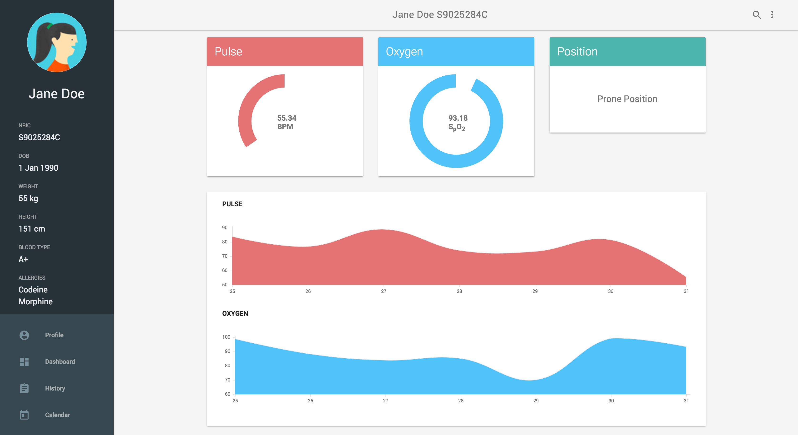

# Patient Dashboard

A mobile responsive dashboard concept for doctors to monitor their patients.



3 fields for patient data:

- Pulse
- Blood Oxygen
- Patient Posture


## Installation

```bash
$ cd src/Web/SerialToBrowser
$ npm install
```

## Usage

### Normal usage

```bash
$ npm start
```

### With simulated data:

```bash
$ npm start -- --simulate  # note the extra '--'
```
or

```bash
$ node index.js --simulate  # equivalent syntax
```

The dashboard can be viewed at [http://127.0.0.1:8080](http://127.0.0.1:8080/) once the server is running.
